# MIS-exp02 无线网卡监听 实验报告

## 0x00 实验练习题

通过分析抓包保存的pcap文件：

- 查看统计当前信号覆盖范围内一共有多少独立的SSID？其中是否包括隐藏SSID？哪些无线热点是加密/非加密的？加密方式是否可知？
- 如何分析出一个指定手机在抓包时间窗口内在手机端的无线网络列表可以看到哪些SSID？这台手机尝试连接了哪些SSID？最终加入了哪些SSID？
- SSID包含在哪些类型的802.11帧？


## 0x01 实验过程

- 启动无线网卡监听模式

  - 杀死可能会导致aircrack-ng套件工作异常的进程：`airmon-ng check kill`
    - 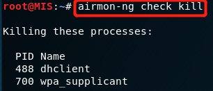
  - 设置无线网卡在监听模式：`airmon-ng start wlan0`
    - 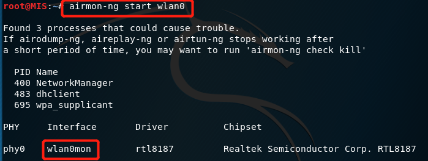
  - 检查无线网卡是否处于启用状态：`ifconfig`
    - 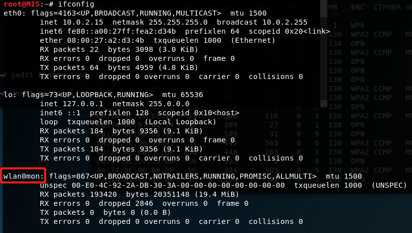
  - 检查无线网卡是否切换到监听模式：`iwconfig`
    - 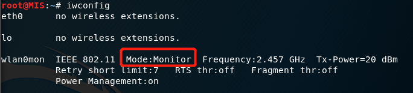
  - `airodump wlan0mon -w 109 --beacon`
    - 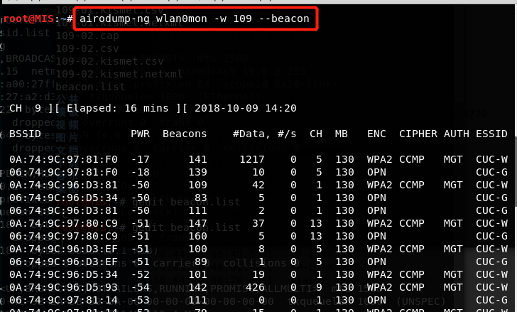
    - 使用 --beacons 参数记录每一个独立BSSID发送的所有beacon frame
    - 将定向监听的结果保存到本地文件109

- 提取beacon帧的SSID信息

  - ```
    tshark -r 109-03.cap -Y wlan.fc.type_subtype==0x08 -T fields -e wlan.sa -e wlan.fixed.capabilities.privacy -e wlan.ssid | sort -d -u > beacon.list
    
    # .cap文件之所以编号为3是因为前两次虚拟机由于宿主机出现问题关闭了，遂重新运行第一步的命令行
    # -Y 筛选器
    # -T 输出格式 可选[ek|fields|json|jsonraw|pdml|ps|psml|tabs|text]
    # -e 将字段添加到要显示的字段列表中
    
    # -d 排序时，处理英文字母、数字及空格字符外，忽略其他的字符
    # -u 忽略相同行，而如果出现多个SSID相同的记录，是因为它们的MAC地址不同
    ```

  - ```
    04:a1:51:2f:38:ce	1	hero111
    06:74:9c:4a:31:6e	0	CUC-Guest
    06:74:9c:4a:32:8a	0	CUC-Guest
    06:74:9c:50:51:82	0	CUC-Guest
    06:74:9c:96:d3:81	0	CUC-Guest
    06:74:9c:96:d3:ef	0	CUC-Guest
    06:74:9c:96:d4:08	0	CUC-Guest
    06:74:9c:96:d4:1c	0	CUC-Guest
    06:74:9c:96:d4:3a	0	CUC-Guest
    06:74:9c:96:d4:3f	0	CUC-Guest
    06:74:9c:96:d5:34	0	CUC-Guest
    06:74:9c:97:80:c9	0	CUC-Guest
    06:74:9c:97:81:14	0	CUC-Guest
    06:74:9c:97:81:f0	0	CUC-Guest
    0a:74:9c:50:51:82	1	CUC-WiFi
    0a:74:9c:96:d4:1c	1	CUC-WiFi
    0a:74:9c:96:d4:3f	1	CUC-WiFi
    0a:74:9c:96:d5:93	1	CUC-WiFi
    0a:74:9c:97:77:fa	1	CUC-WiFi
    0a:74:9c:97:80:c9	1	CUC-WiFi
    0a:74:9c:97:81:14	1	CUC-WiFi
    0a:74:9c:97:81:f0	1	CUC-WiFi
    30:99:35:6a:3a:a8	1	CU_yn5p
    6c:e8:73:e0:e6:34	1	
    70:89:cc:50:7b:e3	1	���������
    72:fe:a1:d1:11:c2	1	CU_JLYR
    78:44:fd:29:41:e2	1	TP-LINK_41E2
    78:44:fd:9b:49:52	1	TP-LINK_702
    78:44:fd:dc:0c:29	1	CUC-B905
    80:f6:2e:13:fa:f0	0	ChinaUnicom
    80:f6:2e:13:fa:f1	0	17 Video Free
    80:f6:2e:13:fa:f2	0	CU_Campus
    80:f6:2e:1e:2e:72	0	CU_Campus
    92:1a:a9:c1:fc:7a	0	CUC-Guest
    92:1a:a9:c1:fc:7b	1	CUC-WiFi
    9c:3d:cf:48:d9:2e	1	CUC_202_76
    c8:3a:35:51:50:18	1	Tenda_515018
    d0:76:e7:29:6b:17	1	TP-LINK_6B17
    d2:1a:a9:c0:5c:6e	0	CUC-Guest
    d2:1a:a9:c0:5c:6f	1	CUC-WiFi
    d2:1a:a9:c2:01:5e	0	CUC-Guest
    d2:1a:a9:c2:01:5f	1	CUC-WiFi
    ```

- 提取Probe Response的SSID信息 

  - `tshark -r 109-03.cap -Y wlan.fc.type_subtype==0x05 -T fields -e wlan.sa -e wlan.fixed.capabilities.privacy -e wlan.ssid| sort -d -u > probres.list`

  - ```
    0a:74:9c:97:80:c9	1	CUC-WiFi
    0a:74:9c:97:81:14	1	CUC-WiFi
    0a:74:9c:97:81:f0	1	CUC-WiFi
    0a:74:9c:97:82:31	1	CUC-WiFi
    12:1a:a9:c2:01:42	0	CUC-Guest
    12:1a:a9:c2:01:43	1	CUC-WiFi
    30:99:35:6a:30:be	1	CU_6Drn
    30:99:35:6a:3a:a8	1	CU_yn5p
    50:64:2b:08:70:89	1	Xiaomi_7088
    52:1a:a9:c1:fd:36	0	CUC-Guest
    52:1a:a9:c1:fd:37	1	CUC-WiFi
    52:1a:a9:c2:01:16	0	CUC-Guest
    70:89:cc:50:7b:e3	1	���������
    72:fe:a1:d1:11:c2	1	CU_JLYR
    78:44:fd:29:41:e2	1	TP-LINK_41E2
    78:44:fd:9b:49:52	1	TP-LINK_702
    7a:44:fd:9b:49:52	1	TPGuest_702.
    92:1a:a9:c0:5b:ca	0	CUC-Guest
    92:1a:a9:c0:5b:cb	1	CUC-WiFi
    92:1a:a9:c1:fc:7a	0	CUC-Guest
    92:1a:a9:c1:fc:7b	1	CUC-WiFi
    9c:3d:cf:48:d9:2e	1	CUC_202_76
    a2:1a:a9:be:01:6b	0	CUC-Guest
    a2:1a:a9:be:01:6c	1	CUC-WiFi
    b0:6e:bf:3f:2a:b0	1	106_2.4G
    b0:6e:bf:3f:2a:b1	1	106_Guest
    c8:3a:35:51:50:18	1	Tenda_515018
    c8:3a:35:bb:57:10	1	Tenda_BB5710
    ce:2d:83:36:93:e9	1	���������������
    ce:e0:10:77:99:d5	1	DIRECT-DBASPIREmsEL
    d0:76:e7:29:6b:17	1	TP-LINK_6B17
    d2:1a:a9:c0:5c:6e	0	CUC-Guest
    d2:1a:a9:c0:5c:6f	1	CUC-WiFi
    d2:1a:a9:c1:fe:9e	0	CUC-Guest
    d2:1a:a9:c1:fe:9f	1	CUC-WiFi
    d2:1a:a9:c2:01:5e	0	CUC-Guest
    d2:1a:a9:c2:01:5f	1	CUC-WiFi
    d2:1a:a9:c2:05:6e	0	CUC-Guest
    d2:1a:a9:c2:05:6f	1	CUC-WiFi
    d2:1a:a9:c2:05:ee	0	CUC-Guest
    d2:1a:a9:c2:05:ef	1	CUC-WiFi
    da:64:c7:23:57:13	1	CMCC
    e4:0e:ee:31:bf:a4	1	JGXY
    ea:3c:85:c3:18:04	1	��������� iPhone
    f4:30:b9:44:1a:52	1	DIRECT-51-HP OfficeJet Pro 8720
    f4:83:cd:23:f0:2f	1	TP-LINK_216
    f4:83:cd:46:b1:8c	1	TP-LINK_B18C
    ```

- 合并beacon.list 和probres.list中的SSID，并去重

  - ```
    sort -m probres.list beacon.list | sort -k3 -u > ssid.list
    
    # -m 合并文件，不排序
    # -k3 -u 根据第3列的值合并去重
    ```

    

  - ```
    6c:e8:73:e0:e6:34	1	
    70:89:cc:50:7b:e3	1	���������				# 咕咕咕
    ce:2d:83:36:93:e9	1	���������������			 # 可爱的胖胖
    b0:6e:bf:3f:2a:b0	1	106_2.4G
    b0:6e:bf:3f:2a:b1	1	106_Guest
    80:f6:2e:13:fa:f1	0	17 Video Free
    80:f6:2e:13:fa:f0	0	ChinaUnicom
    da:64:c7:23:57:13	1	CMCC
    30:99:35:6a:30:be	1	CU_6Drn
    9c:3d:cf:48:d9:2e	1	CUC_202_76
    80:f6:2e:13:fa:f2	0	CU_Campus
    78:44:fd:dc:0c:29	1	CUC-B905
    06:74:9c:4a:31:6e	0	CUC-Guest
    0a:74:9c:4a:2f:5e	1	CUC-WiFi
    72:fe:a1:d1:11:c2	1	CU_JLYR
    30:99:35:6a:3a:a8	1	CU_yn5p
    f4:30:b9:44:1a:52	1	DIRECT-51-HP OfficeJet Pro 8720
    ce:e0:10:77:99:d5	1	DIRECT-DBASPIREmsEL
    04:a1:51:2f:38:ce	1	hero111
    ea:3c:85:c3:18:04	1	��������� iPhone		# 刘星的 iphone
    e4:0e:ee:31:bf:a4	1	JGXY
    c8:3a:35:51:50:18	1	Tenda_515018
    c8:3a:35:bb:57:10	1	Tenda_BB5710
    7a:44:fd:9b:49:52	1	TPGuest_702.
    f4:83:cd:23:f0:2f	1	TP-LINK_216
    78:44:fd:29:41:e2	1	TP-LINK_41E2
    d0:76:e7:29:6b:17	1	TP-LINK_6B17
    78:44:fd:9b:49:52	1	TP-LINK_702
    f4:83:cd:46:b1:8c	1	TP-LINK_B18C
    50:64:2b:08:70:89	1	Xiaomi_7088
    ```

    

- 通过php的内建函数hex2bin()将带有中文的SSID进行转码（此处参考[jckling](https://github.com/CUCCS/2018-NS-Public-jckling/blob/f7e8fe2bacf5aba049ee8bcfa4631476362907d4/mis-0x02/%E7%AC%AC%E4%BA%8C%E7%AB%A0%E5%AE%9E%E9%AA%8C%E7%BB%83%E4%B9%A0%E9%A2%98.md)的实验报告）

  - 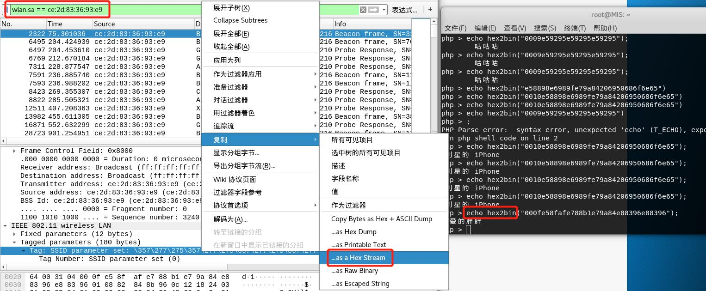

  

## 0x02 问题解答

- 查看统计当前信号覆盖范围内一共有多少独立的SSID？其中是否包括隐藏SSID？哪些无线热点是加密/非加密的？加密方式是否可知？

  1. 查看统计当前信号覆盖范围内多少独立SSID的数量
     - 使用命令`wc -l ssid.list`查看
     - 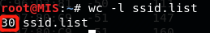
     - **共有30个独立的SSID**
  2. 独立SSID中是否包含隐藏SSID
     - **是**
     - 从上一部分的ssid.list的结果可以看出，第一项的SSID为空，因此它是一个隐藏的SSID
     - 将其MAC地址输入wireshark进行搜索
     - 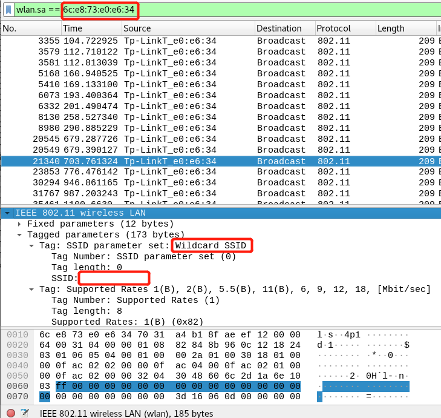
     - wildcard即为匿名的SSID
  3. 区分加密/非加密的无线热点
     - 根据Beacon帧的wlan.fixed.capabilities.privacy判断
       - ssid.list中值为1的为加密的无线热点
       - 值为0的为非加密的无线热点
  4. 加密方式
     - 根据认证帧的wlan.fixed.auth.alg判断
       - 

- 如何分析出一个指定手机在抓包时间窗口内在手机端的无线网络列表可以看到哪些SSID？这台手机尝试连接了哪些SSID？最终加入了哪些SSID？

  - 手机搜寻无线热点时，会广播Probe Request帧，如果该手机在无线热点范围内，则会收到AP返回的Probe Response帧 

  - 在wireshark中，输入`wlan.fc.type_subtype == 0x04`过滤出probe request帧
  - 根据手机的MAC地址，就可以发现这台手机尝试连接了哪些SSID
    - 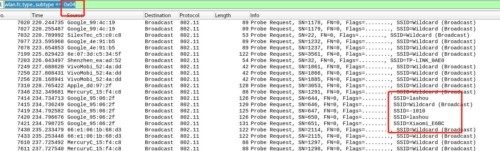
  - 在wireshark中，输入`wlan.fc.type_subtype == 0x01`过滤出association response帧，得到手机接入的SSID
    - 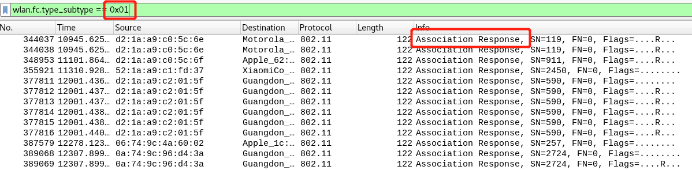

- SSID包含在哪些类型的802.11帧？

  - 根据IEEE的wiki百科中对于management frame的介绍，结合实验，SSID可能包含在下述帧中
    - Beacon Frame（实验涉及）
    - Probe Request（实验涉及）
    - Probe Response（实验涉及）
    - Association Request 
      - `wlan.fc.type_subtype == 0x00`得到结果
      - 
    - Reassociation Request 
      - 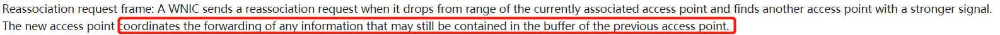

## 0x03 参考资料

- [jckling的实验报告](https://github.com/CUCCS/2018-NS-Public-jckling/blob/f7e8fe2bacf5aba049ee8bcfa4631476362907d4/mis-0x02/%E7%AC%AC%E4%BA%8C%E7%AB%A0%E5%AE%9E%E9%AA%8C%E7%BB%83%E4%B9%A0%E9%A2%98.md)
- [IEEE的wiki百科中关于management frames的部分](https://en.wikipedia.org/wiki/IEEE_802.11#Management_frames)
- [wireshark filter对照](https://www.semfionetworks.com/uploads/2/9/8/3/29831147/wireshark_802.11_filters_-_reference_sheet.pdf)