# Chap0x12 利用bro完成取证分析

## 实验要求

- 利用bro完成指定pcap包的取证分析

## 实验过程

- 安装bro：`apt-get install bro-aux`

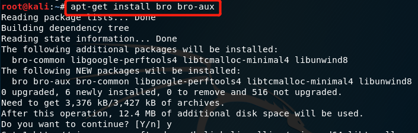

- 查看实验环境信息和bro版本号

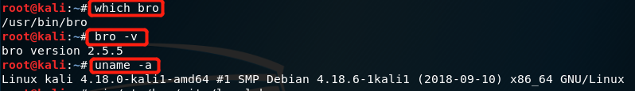

- 修改bro配置文件

  - 编辑`/etc/bro/site/local.bro`，在尾部追加代码

  ```
  @load frameworks/files/extract-all-files
  @load mytuning.bro
  ```

  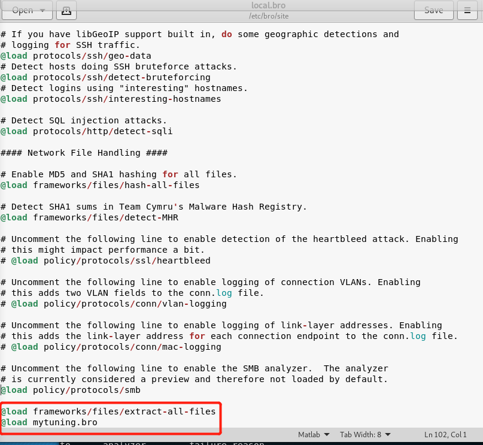

  - 在`/etc/bro/site/`目录下创建新文件mytuning.bro

  ```
  redef ignore_checksums = T;
  ```

  

  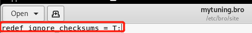

- 使用bro自动化分析pcap文件

  - 创建一个bro的工作目录，通过`wget`下载实验教程中提供的pcap包

  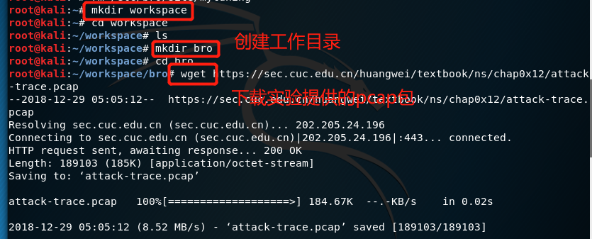

  - 通过指令`bro -r attack-trace.pcap /etc/bro/site/local.bro`读取下载的pcap包

  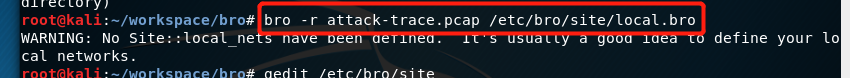

  - 出现的WARNING并不影响实验效果
  - 现在在pcap文件的同目录下会生成一些`.log`文件和一个extract_files目录

  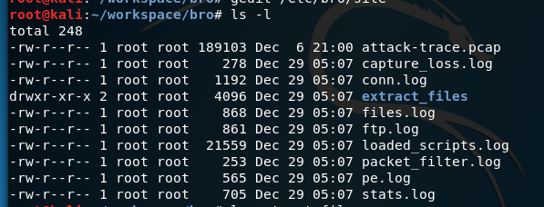

  - 进入extract_files目录，可以看到一个文件

  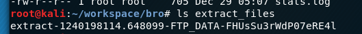

  - 将这个文件上传到`virustotal`，可以得到它的分析报告，显示它是一个后门文件

  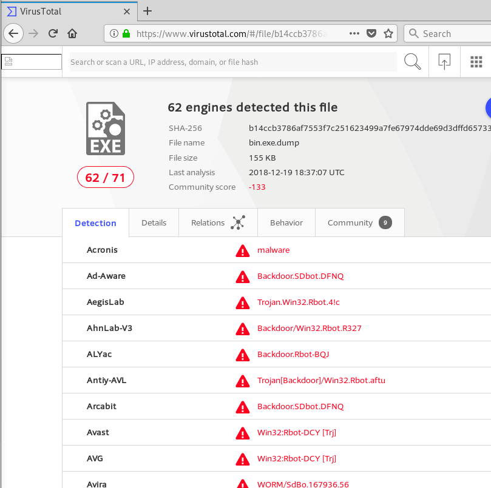

  - 根据该文件的文件名进行逆向倒推，阅读`/usr/share/bro/base/files/extract/main.bro`的源代码

  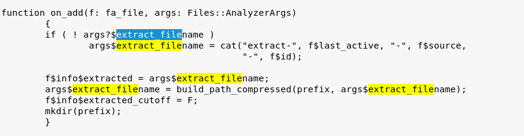

  - 该文件名的最右一个字符串`FHUsSu3rWdP07eRE4l`是`files.log`中的文件唯一标识
  - 通过指令`cat files.log | bro-cut fuid conn_uids`查看`files.log`，这里用到了`bro-aux`软件包中的工具`bro-cut`，只查看`fuid`和`conn_uids`两个列

  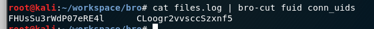

  - 则该文件提取自网络会话标识为`CLoogr2vvsccSzxnf5`的FTP会话
  - 该会话标识在`conn.log`中可以找到对应的IP五元组信息

  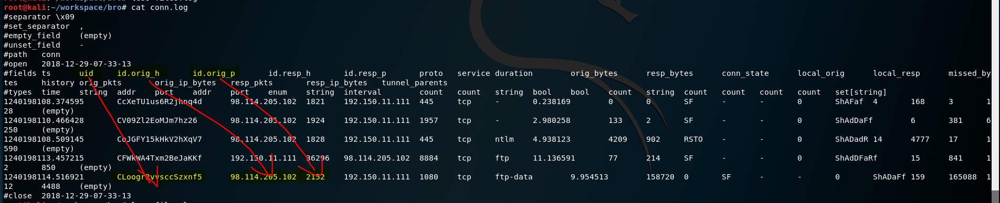

  - 通过`conn.log`的会话匹配，发现文件的来自于IPv4地址为`98.114.205.102`的主机