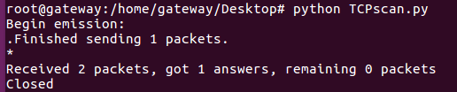
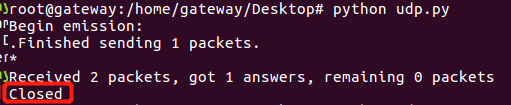

# Chap0x05 自己动手编程实现并讲解多种网络扫描实验报告

## 实验要求

- 实现并讲解
  - TCP connect scan
  - TCP stealth scan
  - TCP XMAS scan
  - UDP scan

## 实验过程

### 0. 实验环境

- 本次使用的源主机是实验1中的网关，ip为10.0.2.5
- 目标主机是实验1中的攻击者，ip为10.0.2.15

### 1. TCP connect scan

#### 原理

- 通过TCP三次握手建立连接，完成扫描
- 如果一台主机要对另一台主机进行扫描，首先会发送一个带`SYN` flag和目标端口号的TCP包
  - 若目标主机的目标端口开放，则收到一个`SYN+ACK`响应，接着源主机会再发送一个`RST+ACK` 作为回应
  - 若目标主机的目标端口未开放，则收到一个`RSR+ACK`响应，源主机不回应
- 若目标主机的目标端口开放，源主机在回复`RST+ACK`之后，完成三次握手同时断开连接

#### 代码

```python
import logging
logging.getLogger("scapy.runtime").setLevel(logging.ERROR)
from scapy.all import *

dst_ip = "10.0.2.15"
src_port = RandShort()
dst_port=80

tcp_connect_scan_resp = sr1(IP(dst=dst_ip)/TCP(sport=src_port,dport=dst_port,flags="S"),timeout=10)
if(str(type(tcp_connect_scan_resp))=="<type 'NoneType'>"):
	print "Closed"
elif(tcp_connect_scan_resp.haslayer(TCP)):
	if(tcp_connect_scan_resp.getlayer(TCP).flags == 0x12):
		send_rst = sr(IP(dst=dst_ip)/TCP(sport=src_port,dport=dst_port,flags="AR"),timeout=10)
		print "Open"
	elif (tcp_connect_scan_resp.getlayer(TCP).flags == 0x14):
		print "Closed"
```

#### 实验结果

- 第一次用命令行执行这个python文件
  - 
  - 由于目标主机没有开放80端口，收到的TCP报文的flag为0x14，即`R+A`对应的十六进制数，因此在终端打印端口关闭的提示
  - 此时切换到目标主机，输入命令行`python -m SimpleHTTPServer 80`，则目标主机80端口开放，此时再次运行py文件
  - 

#### 总结

- TCP connect scan的优点是非常稳定，但是每次都要建立连接实在是太浪费时间了，而且扫描会留下记录，容易被防火墙发现

### 2. TCP stealth scan

#### 原理

- 和TCP connect scan类似
- 区别在于，收到开放端口的`SYN+ACK`之后，只发送`RST`，而不是`RST+ACK`

#### 代码

```python
import logging
logging.getLogger("scapy.runtime").setLevel(logging.ERROR)
from scapy.all import *

dst_ip = "10.0.2.15"
src_port = RandShort()
dst_port=80

stealth_scan_resp = sr1(IP(dst=dst_ip)/TCP(sport=src_port,dport=dst_port,flags="S"),timeout=10)
if(str(type(stealth_scan_resp))=="<type 'NoneType'>"):
	print "Filtered"
elif(stealth_scan_resp.haslayer(TCP)):
	if(stealth_scan_resp.getlayer(TCP).flags == 0x12):
		send_rst = sr(IP(dst=dst_ip)/TCP(sport=src_port,dport=dst_port,flags="R"),timeout=10)
		print "Open"
	elif (stealth_scan_resp.getlayer(TCP).flags == 0x14):
		print "Closed"
elif(stealth_scan_resp.haslayer(ICMP)):
	if(int(stealth_scan_resp.getlayer(ICMP).type)==3 and int(stealth_scan_resp.getlayer(ICMP).code) in [1,2,3,9,10,13]):
		print "Filtered"
```

#### 实验结果

- 

#### 总结

- 隐蔽性要比前一种好，并不建立完整的TCP连接，但需要自己构建SYN数据包
- ZMap可以支持这一种扫描，它的扫描速度还是比较快的


### 3.  TCP XMAS scan

#### 原理

- 源主机向目标主机发送flag设置了`PSH+FIN+URG`的TCP包，其中包含要扫描的端口号
  - 若端口开放，则源主机不会收到任何响应
  - 若端口关闭，则源主机将收到一个`RST`响应
  - 若扫描被过滤了，则目标主机发回一个ICMP ERROR，Type为3，code为1,2,3,9,10或13

#### 代码

```python
import logging
logging.getLogger("scapy.runtime").setLevel(logging.ERROR)
from scapy.all import *

dst_ip = "10.0.2.15"
src_port = RandShort()
dst_port=80

xmas_scan_resp = sr1(IP(dst=dst_ip)/TCP(dport=dst_port,flags="FPU"),timeout=10)
if (str(type(xmas_scan_resp))=="<type 'NoneType'>"):
	print "Open|Filtered"
elif(xmas_scan_resp.haslayer(TCP)):
	if(xmas_scan_resp.getlayer(TCP).flags == 0x14):
		print "Closed"
	elif(xmas_scan_resp.haslayer(ICMP)):
		if(int(xmas_scan_resp.getlayer(ICMP).type)==3 and int(xmas_scan_resp.getlayer(ICMP).code) in [1,2,3,9,10,13]):
			print "Filtered"
```

#### 实验结果

- 

#### 总结

- TCP XMAS的隐蔽性也很好，但也要自己构建数据包


### 4. UDP scan

#### 原理

- UDP是一种面向无连接的不可靠协议，因此UDP scan并不会建立连接
- 源主机发送UDP包+端口号
  - 若目标主机端口开放，则它
    - 可能返回一个UDP包响应
    - 可能不响应
  - 若目标主机端口关闭，则它返回ICMP ERROR，Type为3，code为3


#### 代码

```python
import logging
logging.getLogger("scapy.runtime").setLevel(logging.ERROR)
from scapy.all import *

dst_ip = "10.0.2.15"
src_port = RandShort()
dst_port=53
dst_timeout=10

def udp_scan(dst_ip,dst_port,dst_timeout):
    udp_scan_resp = sr1(IP(dst=dst_ip)/UDP(dport=dst_port),timeout=dst_timeout)
    if (str(type(udp_scan_resp))=="<type 'NoneType'>"):
        retrans = []
        for count in range(0,3):
            retrans.append(sr1(IP(dst=dst_ip)/UDP(dport=dst_port),timeout=dst_timeout))
        for item in retrans:
            if (str(type(item))!="<type 'NoneType'>"):
                udp_scan(dst_ip,dst_port,dst_timeout)
        return "Open|Filtered"
    elif (udp_scan_resp.haslayer(UDP)):
        return "Open"
    elif(udp_scan_resp.haslayer(ICMP)):
        if(int(udp_scan_resp.getlayer(ICMP).type)==3 and int(udp_scan_resp.getlayer(ICMP).code)==3):
            return "Closed"
        elif(int(udp_scan_resp.getlayer(ICMP).type)==3 and int(udp_scan_resp.getlayer(ICMP).code) in [1,2,9,10,13]):
            return "Filtered"
print( dst_port,udp_scan(dst_ip,dst_port,dst_timeout))
```


#### 实验结果

- 一开始UDP端口未开放，则得到的结果为Closed

  - 

- 开放UDP端口可以用Python代码实现

  - ```python
    import socket
    addr = <本机的ip地址>
    port = <希望监听的端口>
    s = socket.socket(socket.AF_INET, socket.SOCK_DGRAM)
    s.bind((addr, port))
    ```

- 开放UDP端口后再次执行代码，则得到open|filtered，和第3种扫描TCP XMAS一样，无法确定它的最终状态

  - 


#### 总结

- 隐蔽性好过TCP connect scan


## 个人想法

- 因为最近恰好在做大作业的文献翻译，目前正在翻的就是ZMap网络扫描，所以感觉对网络扫描的了解稍微透彻了一些，ZMap使用的是不建立连接的扫描，支持TCP SYN scan、ICMP echo扫描，默认源主机只对一台目标主机发送一个数据包（可以更改设置），文献中指出其实只发送一个数据包就可以扫描到全IPv4地址空间中98%以上的开放端口，少部分丢包是可以完全忽略不计的
- 网络扫描在漏洞挖掘、发掘非法暗网等方面都有良好的应用，对信息安全来说有不小的价值，ZMap就是一个可以辅助进行上述两种工作的快速互联网扫描器


## 参考资料

- [TheMasterOfMagic-NSchap0x05](https://github.com/CUCCS/2018-NS-Public-TheMasterOfMagic/blob/18cec0263d504ea9c31fb34ba8b4d41ac20cc642/ns/chap0x05/%E5%B8%B8%E8%A7%81%E7%BD%91%E7%BB%9C%E6%89%AB%E6%8F%8F%E6%96%B9%E5%BC%8F%E7%BC%96%E7%A8%8B%E5%AE%9E%E8%B7%B5%E5%AE%9E%E9%AA%8C%E6%8A%A5%E5%91%8A.md)

- https://resources.infosecinstitute.com/port-scanning-using-scapy/

- ZMap网络扫描：https://github.com/CUCCS/ns/blob/master/papers/ZMap-%20Fast%20Internet-wide%20Scanning%20and%20Its%20Security%20Applications.pdf