# ZMap：快速互联网扫描及其安全应用

- Zakir Durumeric
  - 密歇根大学
  - zakir@umich.edu
- Eric Wustrow
  - 密歇根大学
  - ewust@umich.edu
- J. Alex Halderman
  - 密歇根大学
  - jhalderm@umich.edu

## 摘要

互联网范围内的网络扫描拥有数量庞大的安全应用方向，包括漏洞挖掘、跟踪防御机制的采用状况等；然而使用现有的工具探测整个公共地址空间是十分困难的，且整个过程速度缓慢。在此，我们采用了ZMap这个软件，一个模块化、开源的网络扫描器，专门为进行互联网扫描而设计，可以使用户在一台计算机上探测整个IPv4地址空间，而耗时不超过45分钟——接近千兆以太网理论上的速度极限。我们展示了这个扫描器的架构，通过实验体现了它在性能及准确度方面的特点，同时从攻防两个角度探究了高速互联网规模下的网络探测在安全方面的意义。除此之外，关于在进行互联网探测时一个良好互联网公民的最佳做法，我们也做出了探讨——该探讨的依据来源于过去几年我们亲自设计进行的一个长期调查。

## 1 介绍与指南

互联网规模下的网络探测是通过侦测公共IP地址空间内大量的子网实现的。虽然这样的扫描行为往往和僵尸网络、蠕虫病毒联系在一起，但现已证明它对于网络安全的研究大有裨益。近来的研究指出，互联网范围内的扫描在挖掘新型漏洞、监督风险防范措施的发展、及揭示此前不透明的分散式互联网生态系统等方面有很大帮助[10, 12, 14, 15, 25, 27]。而不幸的是，网络扫描的方法论在过去更容易被互联网中的攻击者所利用，而合法的研究人员由于不能布置盗取的网络接入点或是散播可自我复制的恶意代码，往往很难进行网络扫描；要使用现成的工具，如Nmap等[23]，对公共的地址空间进行综合扫描，却需要花费数周的时间或是动用多台机器。

在本文中，我们采用的是ZMap，一个模块化的、开源的网络扫描器，它专为进行全面的互联网研究性扫描设计。一台中档的计算机运行ZMap，就可以在45分钟内扫描整个公共IPv4地址空间内所有的开放端口——超过千兆以太网速度极限的97%，却不需要任何专门的硬件[11]或内核模块[8, 28]。ZMap的模块化设计使它能够支持许多单包探测帧，包括TCP SYN扫描、ICMP响应请求扫描、及专用UDP扫描；同时，它也能轻松与用户提供的代码进行交互，以便在已发现的主机上进行后续操作，比如完成一次协议握手。

与Nmap——一款优秀的通用网络映射工具，近年来常被用于互联网范围内的调查研究[10, 14]——相比，ZMap在互联网规模下的扫描功能上有更良好的表现。通过实验，我们发现ZMap能在准确度与Nmap相同的情况下，以比Nmap最大限度的默认设置高出1300倍的速度扫描IPv4地址空间。ZMap能有这样的性能表现，是因为它在网络扫描方面的设计被专门地优化了：

**侦测性能优化** 为避免源网络和目标网络达到饱和，Nmap会调整它的传输速率，我们假设源网络预防措施良好（即不会因为源主机达到饱和），且目标网络乱序分布在一个较大范围内（这样就不会有远距离网络或路径可能因扫描达到饱和）。于是，我们尝试以源主机的网卡能承受的最大速率发送探测帧，跳过TCP/IP栈直接生成以太网帧。结果显示，ZMap可以在整个用户空间中、通过商品硬件以千兆网的速度发送探测帧。

**不保持每次的连接状态** 为追踪已被扫描的主机、处理超时和重传，Nmap维持着每次连接的连接状态，而ZMap并不会保持每一次的连接状态。由于ZMap的传送目标是从地址空间中随机选取的，它并不需要将已扫描过或需要扫描的地址保存下来，而供它选取的随机地址序列是通过一个乘法循环群生成的。与追踪连接是否超时不同，ZMap在扫描周期内接收带有正确状态字段的响应包，这使它可以从收到的响应中提取足够多的数据。ZMap在每个发送出去的数据包内过载无用的数据，用以区分后台网络流量中的有效探测响应，这种做法与SYN cookies类似[4]。

**无重传机制** Nmap检测连接超时并据此重传由于丢包而没有送达的探测帧，而ZMap（为避免保持某个状态）往往对每个目标发送指定数目的探测帧，且这个数目的默认值为1。在我们的实验体系中，我们估测ZMap在对每台主机只发送一个探测帧的情况下，可以达到98%的网络覆盖率。我们认为，小数目的丢包对典型的研究应用来说是无关紧要的。

我们将在第2节中更为深入地描述ZMap的架构和实现，并在第3节通过实验展现它的性能特点。在第4节中，我们从攻防双方的角度研究了快速、低廉的互联网扫描的广泛使用有何意义，并阐述了ZMap在一系列安全设置中的表现和灵活性，包括：

*衡量协议的采用*，如从HTTP到HTTPS的转换。我们在一年的时间内根据频繁的网络扫描探究了HTTPS的采用性。

*分布式系统的可见性，如认证机构（CA）的系统。我们收集并分析了TLS证书并对错误发行的CA证书进行了判定。

*高速漏洞扫描*，这使攻击者可以在数小时内从他们的发现中广泛地挖掘出漏洞。我们借助ZMap构建了一个UPnP扫描器，通过它发现了340,000个存在已知漏洞的UPnP设备[25]。

*发掘未公开服务*，如隐藏的洋葱路由器桥。我们展示表明，ZMap可以通过综合枚举定位86%的隐藏洋葱路由器桥。

高速扫描可以在安全研究人员的掌控下成为一种强有力的工具，但用户一定要小心，不要在不经意间导致网络过载或是为网络管理员增添不必要的工作。在第5节中，我们讨论了我们在过去几年的时间内进行的数个大规模扫描实验，提出了若干方针及扫描过程中一个良好互联网公民的最佳做法。

互联网作为一种研究方法已经展现出了极大的潜力[10, 12, 14, 25]，我们希望ZMap可以促进一系列新型应用的出现，因为它能够大幅减少综合性网络探测的花销，且允许扫描在十分精细的时间粒度下进行。为实现这一期望，我们以开源项目的形式发布了ZMap，并为实际应用配备了文档和安装包，可以通过网址 https://zmap.io/ 进行获取。

## 2 ZMap扫描器

如图1所示，ZMap的模块化设计使其可以支持多种探测帧，甚至适用于大量研究型应用的集合。命令行及配置文件解析、地址生成和排除、进程和性能监管、以及读写网络数据包这些工作，全部由扫描器的内核处理。可扩展的探测模块为各种各样的探测帧量身打造，同时也负责生成探测数据包，以及判断流入的数据包是否为有效响应。模块化的输出控制器可以将扫描结果通过管道传送到其他进程，也可以直接将其添加到数据库，或是传给用户代码等待下一步操作，如完成一次协议握手。

我们在第1节中介绍了ZMap背后的设计思想。从高级一点的层面上来说，ZMap最重要的构建特色之一是在不同的线程中进行发送及接收数据包的过程，这些线程独立工作，并在整个扫描过程中都处于工作状态。为确保这些进程的共享状态尽可能地少，设计过程中我们做出了大量的选择。

我们通过8900行左右的C语言代码实现了ZMap的功能，编写和测试使用的操作系统是GNU/Linux。

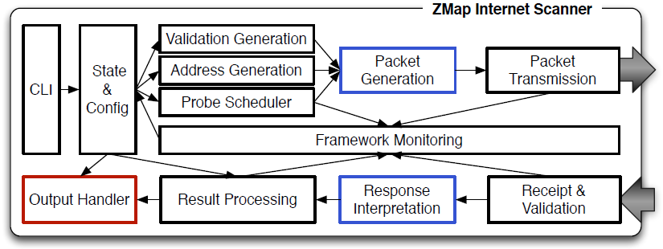

图1：ZMap架构——ZMap是一个开源的网络扫描器，为实现高效的互联网规模网络探测进行了优化。模块化的数据包生成及响应解析组件（蓝色部分）支持多种类的探测，包括TCP SYN扫描及ICMP响应扫描。模块化的输出处理器（红色部分）允许用户对扫描结果进行输出或其他操作，专门适应各类应用。整个架构使得发送及接收组件能够异步运行，同时让一台单独的机器能够对公共IPv4地址空间内的所有主机进行综合性扫描，只需要一条1Gbps的以太网连线，就可以在45分钟内扫描上述所有主机的特定TCP开放端口。

### 2.1 地址探测

若ZMap只是简单地按照数字大小顺序探测每个IPv4地址，其产生的扫描流量就有可能导致目标网络过载，也可能因为远程瞬态网络故障得到不正确的扫描结果。为避免这一情况的发生，ZMap将根据地址空间的随机排列进行扫描。得到这个序列之后，我们仅仅扫描整个列表中的部分网络，这样就可以选择地址空间内较小的随机样本。

ZMap采用了一种简单而低廉的方法遍历地址空间，该方法使其能够以随机序列进行扫描而只保持可忽略不计的连接状态。我们对一个模p的整数乘法群进行迭代，其中p选择为一个比$2^{32}$稍微大一点的数字。由于p是一个素数，我们可以保证这个乘法群具有循环性，并在每个周期内能涉及到IPv4地址空间内除0.0.0.0（IANA为方便某些目的而保留的地址）以外的所有地址。我们选择在模p的乘法群$(Z/4,294,967,311Z)^×$中进行迭代，p是一个比$2^{32}$稍大一些的数：$2^{32}$ + 15。

每一次扫描之前我们会为这个乘法群生成一个新的原根，同时选择一个随机的起始地址，这样每一次扫描时挑选的随机序列就都是崭新的了。由于乘法群中的元素顺序由这个乘法群的同构保持，通过同构$(Z_{p-1}, +) ≌ (Z_p^*, ×)$ ，并将$(Z_{p-1}, +)$的根由函数$f(x) = n^x$（其中n是$(Z/pZ)^×$的已知原根）映射到乘法群中，我们可以有效地找到乘法群的随机原根。在我们实验的特定情况下，已知3是$(Z/4,294,967,311Z)^×$这个乘法群的一个原根。

由于我们已知$(Z_{p-1}, +)$的生成元的集合为$\{s|(s,p-1) = 1\}$，通过预先计算并记下$p-1$的因子，随机检测与$p-1$的因子不相等的的地址，直到找到一个和$p-1$互素的的地址，就可以快速地找到这个加法群的生成元，将其映射到$ (Z_p^*, ×)$中。鉴于存在的生成元大约有$10^9$个，进行4次尝试就有机会找到一个原根。尽管这个过程为扫描的开头增添了复杂度，但它实际上一次只会花费极少的一部分时间。

一旦生成了一个原根，遍历地址空间就变得很容易了，我们只需要将在群上定义的运算应用到当前地址上就可以（即用原根模$2^{32} + 15$的结果乘以当前地址）。当再次检测到第一个被扫描的IP地址时，扫描结束。这项技术使得发送数据包的线程只用三个整数就能得到选定的扫描序列以及扫描的进度，这三个整数即为：用于生成乘法群的原根，首次扫描的地址，以及当前地址。

**需排除的地址** ZMap进行的是互联网范围内的扫描，因此我们将扫描的目标设置为全体IPv4地址，但这之中也需要排除一小部分指定地址，一是出于对性能的考虑（例如，IANA的预留分配地址[16]），二是为了满足某些地址持有者的需求——他们可能中断对所持地址进行的扫描。为高效地找到需排除的地址，我们选用了基数树——一种查找树，专为处理区间问题设计，常用于路由表中[32, 34]。可以在配置文件中指定排除区间。

### 2.2 包的传输与接收

ZMap优化后，能够以源主机的CPU和网卡所能支持的最大速率发送探测帧。包生成组件异步地运作在多线程中，每道线程通过原始套接字紧密地循环发送以太网数据帧。

之所以在以太网层发送数据包，是为了缓存包数据并减少不必要的内核开销。例如，以太网的报头——除数据包的校验值之外的部分——在扫描过程中并不会发生改变。生成、缓存以太网数据包，可以避免Linux内核对每个数据包都进行路由查找、arp缓存查找、以及网络过滤检测。而在进行TCP SYN扫描时使用原始套接字则有一个额外的好处，那就是不需要在内核中建立任何TCP会话，一旦接收到一个TCP SYN-ACK数据包，内核将自动回复一个TCP RST数据包，随后立即关闭连接。此外，ZMap还可以选择多个源地址，分布式、轮询地往外发送探测帧。

我们在ZMap的接收组件中运用了libpcap库，用于捕获网络流量以及过滤接收到的数据包。尽管libpcap是一个潜在的性能瓶颈，输入的响应流量也只是输出的探测流量的一小部分，这是因为绝大部分的主机并不会响应普通的探测帧，而且我们发现，在我们的测试中，libpcap可以处理起响应流量来可以说是轻而易举（详见第3节）。每收到一个数据包，我们会检测它的源端口和目的端口，丢弃掉明显不是由扫描引起的数据包，并将剩下的数据包传递到空闲的探测模块进行译码。

ZMap的发送、接收组件是独立工作的，我们需要确保接收组件的初始化优先于发送组件，同时保证接收组件在发送组件完成发送之后持续工作一段时间（默认是8秒），这样就可以处理所有延迟的响应包了。

### 2.3 探测模块

ZMap探测模块的功能包括填充探测数据包以及验证收到的数据包是否能与探测帧对应。将这些工作设计为模块化的形式，使得ZMap可以支持各种各样的探测方式与网络协议，同时也使其扩展性得到了简化。除此之外，ZMap的探测模块还能够同时支持TCP端口扫描和ICMP响应扫描。

在初始化阶段，扫描器的内核会为数据包留出一部分空缓存，而探测模块会填充数据包的一些静态内容，这部分内容对于所有目标来说都是一样的。接着，扫描到每台特定的主机时，探测模块再更新这块缓存，这时填充的就是针对该主机生成的特定值了。

例如，ZMap实现了一种便于进行TCP端口扫描的探测技术，即SYN扫描(SYN scanning)或半开放扫描(half-open scanning)。我们之所以选择实现这种技术，是为了避免建立完整的TCP握手，在这种扫描中，交换数据包的数量是经过削减的。在大多数主机不可达或是无响应的情况下，只需要使用一个数据包（从扫描器发出的SYN包）；而对于关闭端口来说，要交换的数据包有两个（一个SYN包和一个作为其响应的RST包）；以及在端口开放这一并不常见的情况下，需要用到三个数据包（一个SYN包、一个SYN-ACK响应和一个从扫描器发出的RST包）。

**检验响应的完整性** ZMap的接收组件需要从众多的网络流量中分辨出有效的数据包，即原始探测数据包的响应包[4]。

对于每一个受扫描的主机，ZMap都会计算出一个加密的MAC目标地址，加密的密钥对每次扫描来说是特定的。这个MAC接下来就会经由启动的探测模块传播到任何可达的地址域。我们选择使用UMAC函数来进行这个操作，基于它拥有性能上的保障[5]。在TCP端口扫描模块中，我们利用了源端口和初始序列号；对于ICMP，我们使用了ICMP标识符以及序列号。在探测模块接收数据包时，会对这些字段进行检测，ZMap将会丢弃所有未通过验证的数据包。

这些开销不大的检测能够阻挡由后台网络流量产生的欺骗性数据包，这些数据包会引起误报，同时也能过滤掉之前扫描产生的响应。这个设计最终使得接收方在验证响应的同时，和发送组件共享同一把扫描的密钥和相同的初始配置。

### 2.4 输出模块

ZMap提供了一个模块化的输出接口，允许用户输出扫描结果或是对它们进行其他特定操作。输出模块的回调由特定事件触发：扫描的初始化过程、探测数据包已发送、接收到响应、常规进程的更新，以及扫描终止。ZMap内建的输出模块能够解决所有基本用途，包括简单的文本输出（一个包含不重复IP地址列表的文件流，每个地址都有特定的开放端口）、拓展的文本输出（一个包含所有响应数据包和时间数据列表的文件流）以及一个排列在Redis内存数据库中的扫描结果的接口[29]。

输出模块还可以实现触发网络事件，作为积极扫描结果的响应，比如完成一次应用层的握手。对于TCP SYN扫描来说，实现上述操作最简单的方法就是与传来响应的地址创建一个新的TCP连接；这个过程可以和扫描异步进行，且并不需要任何特殊的内核支持。

**forge_socket** 一些ZMap用户可能希望在一次TCP SYN扫描中开始TCP握手，或者是希望在没有建立新连接这一负担的情况下与远程主机交换数据。当目标主机认为初始的SYN/SYN-ACK交换已经建立好连接的时候，ZMap将绕过目标主机本地系统的TCP栈，这样它的内核就无法识别出本次连接。

为使进行扫描的主机能通过由ZMap发起的TCP会话建立通信，我们在ZMap中采用了forge_socket，一个允许用户进程传入会话参数（如初始序列号）的内核模块。这使得通过ZMap初始化的握手进行的应用层握手并不需要多余的RST、SYN或者SYN-ACK数据包的传送，这些不必要的数据包传送可能会被要求关闭已有的连接，创建一个新的、内核可识别的会话。我们将在发布ZMap的同时发布forge_socket。

## 3 校验与量度

为特征化描述ZMap的性能，我们进行了一系列的实验。在实验的设置阶段，我们找到了IPv4地址空间内的一次完整扫描，这次扫描大约耗费了44分钟的时间，在一台入门级别的、使用千兆以太网连接的服务器上进行。我们估计，一次单包扫描可以探测98%左右即时开放的主机，此外我们还计算出，ZMap在覆盖率相同的网络扫描中，性能比NMap优化了1300倍。

我们在一台内置Xeon E3-1230 3.2GHz处理器和4GB内存的HP ProLiant DL120 G7上进行了一系列量度计算，这台计算机运行在Ubuntu 12.04.1 LTS的操作系统上，该操作系统搭载了3.2.0-32-generic Linux内核。实验是通过计算机的内置网卡进行的，这块网卡的结构基于Intel的82574L芯片集，其本身用到了一个容量1000e的网络驱动器。对于涉及到TCP握手的实验，我们关闭了用于构建jptables和连接跟踪的内核模块。比较ZMap和Nmap二者性能的实验用到的Nmap版本为Nmap 5.21。

所有的测量计算都是在密歇根大学计算机科学与工程学院搭建的常规网络中进行的。我们使用的上行线路是一个千兆以太网（在我们的设施中，它是一个标准的办公网络连接）；除静态IP地址以外，我们没有安排任何特殊的网络设置。网络中介质访问控制子层的运行速度是10gbps，且校园中其余的上行线路共计有 2 × 10 千兆比特的端口信道。我们注意到，由于本地拥塞，ZMap在其他源网络上的性能可能比这里报告的要差。

### 3.1 扫描速率：怎样才算太快？

为确定我们的扫描器及上游网络能否处理速度上千兆的扫描，我们对扫描速率，即ZMap发送探测数据包的速率，对命中率，即作出积极响应（在本次实验中，积极响应即为SYN-ACK包）的受探测主机占比，是否有影响进行了检测。如果抓到的包、Linux内核、我们学院的网络，或者我们的上游网络供应并不能很好地处理扫描器在以最大速率运行的情况下产生的网络流量，我们预计会出现丢包或命中率低于扫描率的情况。

我们的实验以不同的扫描率向1Pv4地址空间内1%的随机样本发送TCP SYN数据包，涵盖了从1000~1.4M个数据包每秒的16种扫描速率，每种速率都进行了10次测试。图2展示了测试的结果。

我们发现，从实验数据来看，扫描率和命中率之间并没有特别重大的联系。这说明我们的ZMap设置可以处理每秒发送1.4M数据包的扫描，且低速率的扫描对识别额外的主机方面并没有任何作用。从建设性的角度来说，这保证了我们以抓包为基础的接收模块能够处理扫描器在最大速率情况下产生的响应，也就是在千兆网的情况下运行扫描进程并不需要类似PF_RING[8]的特殊内核模块。

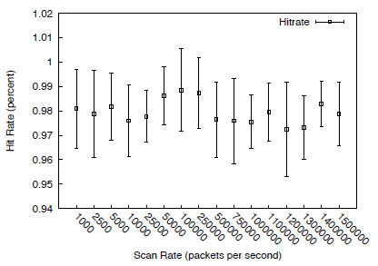

图2：**命中率vs扫描率**——我们发现命中率（积极响应数/受探测主机数）和扫描率（发送的探测帧数/秒）并不相关。图示为十次测试的均值和标准差。这表明低速率的扫描并不能发掘额外的主机。

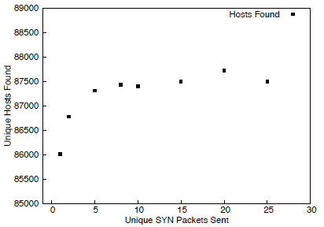

图3：**复数探测帧的覆盖率**——发现的主机数量在ZMap发送了8个SYN包之后达到一个比较稳定的值。如果这个稳定值代表了开放主机的真实数量，那么只发送1个SYN包的覆盖率能达到98%。

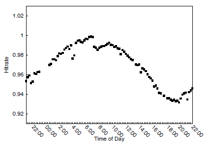

图4：**日间不同时段对发现的主机数量的影响**——我们观测到，扫描进行的不同时段会对ZMap的命中率造成±3.1%的差异。（美国东部标准时间。）

### 3.2 覆盖率：一个SYN包足够吗？

虽然以较高的速率扫描似乎不会降低命中率，但这并不能说明一次扫描可以达到怎么样的覆盖率——ZMap使用其默认的单包探测策略实际上可以找到多少目标主机呢？

由于缺少Internet上开放了特定端口的主机数量的真实数据，我们不能直接测量覆盖率。同时因为互联网的状态在不断地变化，情况可能变得更加复杂；由于主机当时不可用或是在扫描器和主机之间发生了丢包等原因，想要检测一台主机是否包含在一次扫描中是非常困难的。然而，要想理解在互联网扫描中，执行快速的单包扫描是否为一种正确的方法论，这个问题至关重要。

为了描述ZMap的覆盖范围，我们向一个大的地址样本空间发送了多个不同的SYN包，并分析了接收到的积极响应的数量分布规律，将其与我们发送的SYN包数量进行比较。通过这一系列操作，我们可以估计出真正处于监听状态的主机数量。我们期望最后能够看到检测到的主机数量达到一个比较稳定的值，之后再发送的SYN包数量将不会对这个值造成影响。如果这个稳定值存在，我们就可以将其作为监听状态主机真实总数的一个估计值，有了这个值，我们就可以用它作为基准，判断使用更少的SYN包进行的扫描会产生什么样的结果了。

在这个实验中，我们向IPv4地址空间内1%随机样本的443端口分别发送了1、2、5、8、10、15、20、35个SYN数据包。结果表明，发送8个SYN包后，响应主机的数量出现了明显的稳定值，如图3所示。

根据这个稳定值的大小，我们估计，将发送的包数量设置为1时，大概能覆盖97.9%的活跃主机；将发送的包数量设置为2时，能覆盖98.8%的主机；而设置为3时，覆盖的主机数量达到了99.4%。单包的往返丢包率约为2%，这与以往对互联网上随机丢包的研究一致[12]。

上述实验结果表明，单包扫描足以全面地适用于典型研究性应用。想要达到更高覆盖率的研究人员可以设置ZMap向每台主机发送多个探测帧，但这会导致扫描的时间在一定程度上增加。

### 3.3 一天中不同时段的差异

在以往的研究中，互联网范围内的扫描可能会花上几天甚至几个月去执行，所以几乎没有人关心如何找到一天中的最佳扫描时间。然而，因为ZMap的扫描不到一个小时就可以完成，关于进行扫描的“正确时间”的问题，就应运而生了。在一天中有没有某几个小时，或是在一周中有没有某几天，扫描能比其他时候进行得更有效呢？

为了测算一天中的时间对扫描的影响，我们对TCP443端口进行了连续扫描，在24小时内随机抽取1%的互联网地址样本作为目标主机。图4展示了每次扫描找到的主机数。

我们观测到，随着一日内扫描时间的变化，命中率有3.1%的上下波动。响应率最高的时段大概是在东部标准时间（EST）的早上7:00，最低的时段大约是在晚上7:45。

这些影响可能是整体网络拥塞和丢包率造成的，也可能是由于某些仅间歇连接到网络的终端主机整体性能的日模式。尽管按星期和按月进行的测试不如按日的测试那样正式，但我们并没有注意到扫描率在按星期和按月时有任何明显的变化。

### 3.4 与Nmap的比较

我们做了几个实验来比较ZMap和Nmap在Internet范围内的扫描应用，侧重于覆盖范围和完成扫描所需的时间。Nmap和ZMap都针对不同的目的进行了优化。Nmap是一种高度灵活、多用途的工具，经常用于探测数量较少的主机上的大量开放端口，而ZMap则优化为跨大量目标探测单个端口。我们选择这两者进行比较不仅是因为最近的安全研究使用了Nmap用于网络调查[10, 14]，还因为Nmap与ZMap一样，是在Linux上操作用户空间的[23]。

我们测试了各种Nmap设置，以找到合理的配置进行比较。所有扫描都在TCP SYN 443端口（-Ss -p 443）上进行。Nmap提供了一些称作计时模式（time templates）的默认设置，但是即便选用其中最迅猛的（标记为“insane”）设置，一次全互联网的扫描也需要一年多的时间才能完成。为使我们测试配置的Nmap以更快的速度扫描，我们启用了“insane”模式（-T5），禁用了主机发现和DNS解析（-Pn -n），并设置了一个较高的最小包速率（--min-rate 10000）。“insane”模式在每次探测超时之后进行重新尝试，我们另外测试了一种Nmap配置，试着禁用它的重新尝试功能（--max-retries 0）。

我们使用ZMap随机选择了1000000个样本IP地址，再用Nmap对它们的开放443端口进行了扫描，Nmap采用上述的两种配置方式，ZMap则采用其默认配置以及另一种对每台主机发送两个SYN探测包的配置（-P 2）。我们在12小时内重复了10次扫描，表1中反映了扫描的均值。

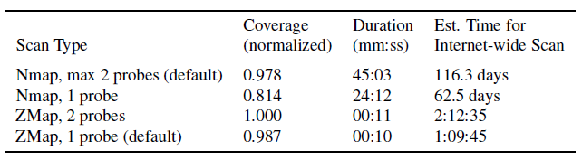

表1：**ZMap vs. Nmap**——我们分别使用ZMap与Nmap扫描了10000000台主机的TCP 443端口，取10次实验的平均值。且不论ZMap的运行速度比Nmap要快了上百倍，它所能找到的开放主机也比Nmap要多，这是因为Nmap超时时限更短。ZMap的时间包括一个固定的8秒延迟，用于在最终探测之后等待响应。

结果表明，ZMap的扫描速度要快得多，且ZMap能找到的监听主机数比任何一种Nmap配置找到的都更多。报告的ZMap持续时间包括发送帧的时间，以及发送过程完成后8秒的固定延迟，在此期间ZMap等待延迟响应。根据互联网范围内扫描所需的时间推断，最快的测试ZMap配置完成速度大约是最快的Nmap配置完成速度的$1300倍^1$。

**覆盖率及超时** 为了研究为什么ZMap能比Nmap获得更高的覆盖率，我们在TCP 80端口上随机选取了430万个地址，并测量了从响应主机发送SYN到接收SYN ACK之间的延迟。图5展示了结果的CDF。往返时间的最大值为450秒，而一小部分主机发送回应的时间超过了63秒，TCP连接在Linux上尝试超时所花费的时间。在500秒内做出响应的主机中，有99%的主机都在1秒内完成了响应，而99.9%的主机都在8.16秒内做出了响应。

由于ZMap的接收代码相对于发送代码是无状态的，因此在扫描完成之前任何时候返回的有效SYN ACK都将被记录为侦听主机发来的数据包。为保证高水平的覆盖率，ZMap的默认设置包含了一项由经验推导而来的8秒延迟，这个延迟从最后一个探测帧发出开始，一直到接收进程结束之前。

与ZMap正相反，Nmap对每个探测帧都设置了超时。在我们测试的Nmap“insane”模式下，超时的初始设置为250毫秒，在这个时间段内我们测试中可应答的主机仅有少于85%的主机进行了响应。在扫描的过程中，Nmap的超时阈值可以增加到300毫秒，这个时间段内又93.2%的主机可以响应。因此，我们预计单帧Nmap扫描可以在设置的超时阈值内找到ZMap发现的主机数的85-93%，这与观测得到的值82.5%大致相近。

在“insane”默认设置下，Nmap将在超时之后尝试第二次发送探测帧。在第二次超时发生之前，第一次和第二次发出的SYN包得到的响应都会认作是有效的，这有效地将总超时时间延长到了500-600毫秒，在这样一个时段内，我们可以接收到98.2%-98.5%的响应。其余的响应可能是由第二个SYN包产生的。我们观察到，发送两个探测帧的Nmap扫描能够找到ZMap发送一个数据包能找到的主机数的99.1%。

- 1得到这个推论的1包ZMap互联网扫描进行的完整时间比44分钟要长，这是因为这个测试使用了一块基于Inter 82574L芯片集的网卡，它的速度比较慢。

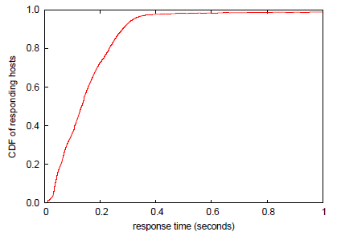

图5：**从发送SYN到接收SYN-ACK的时间**——在一次探测了430万台主机的实验中，99%的SYN-ACK数据包在1秒内到达，而99.9%的SYN-ACK数据包在8.16秒内到达。

### 3.5 与以往研究的比较

若干研究小组之前也通过各种各样的方法进行了互联网范围内的调研。这里我们将ZMap与最近的两个侧重于HTTPS认证的研究做一个比较。距今最近的一次研究中，Heninger等人于2011年进行了一次443端口的扫描，作为加密密钥生成的全球性分析的一部分[14]。他们的扫描是在Amazon EC2上使用Nmap实现的，据报告每秒平均可扫描到40556台主机。而2010年EFF SSL观测站项目进行的扫描则是在三台主机上进行的，共耗费3个月完成[10]。

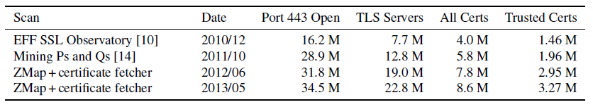

表2：**与以往互联网HTTPS调研的比较**——由于HTTPS部署范围的扩增，ZMap发现的TLS服务器数量几乎是SSL观测站于2010年底发现数量的三倍，而相比起后者的3台主机、3个月，基于ZMap的工作流完成这一过程仅使用了一台主机，用时仅为10小时。

为比较ZMap在这项任务方面的性能，我们使用它对443端口进行了一次全面的扫描，同时还用到了一个定制的证书获取工具，该工具基于libevent及OpenSSL，用于检索每台响应主机的TLS证书。通过这个方法，我们就能够在一台机器上发现主机、执行TLS握手，并在10小时内收集和解析结果证书了。

如表2所示，我们发现的TLS服务器数量远远超过了以往研究中的数值——比Heninger 等人多出78%，比SSL观测站高出196%——这可能是因为自这两项研究以来，HTTPS的部署范围扩大了。线性回归显示，在SSL观测实验的扫描和我们最近一次收集数据相距的29个月内，平均每月HTTPS部署的增长大约为54万台主机。尽管没有这样的增长，ZMap仍然能够仅花费早期工作中一小部分的时间和开销收集全面的TLS证书数据。SSL观测站要收集到同样的数据大约要花费650倍的机器时间，Heninger et al.则大约要花费65倍。

## 4 应用及安全性影响

在一小时内扫描IPv4地址空间的能力开启了一系列新研究的可能性，包括以前一些不透明的分布式系统的可见性能力，在新的决议中了解应采用的协议，以及揭露一些仅通过全球性视角才能发现的安全现象[14]。然而，高速扫描可能也存在一些潜在的恶意应用，比如对一些脆弱主机发起全体查找和攻击等。此外，许多开发人员还抱有一些先入为主的观念，那就是互联网的范围实在太大，不可能完全进行枚举，因此高速扫描的实际应用可能会干扰现存的安全模型，例如，它可能会造成人们发现一些以前被认为很好隐藏了的服务。在本节中，我们将使用ZMap对这些应用中的一部分进行探索。

### 4.1 分布式系统可见性

高速的网络扫描为研究人员提供了一种新的可能性，即以一种实时的视角去观察此前互联网中不透明的分布式系统。例如，电子商务和安全web事务本质上依赖于受浏览器信任的TLS证书。然而，目前对浏览器可信证书颁发机构(CA)或已颁发证书的监管很少。大部分CA并不会公开它们已经签名的证书列表，此外，由于中级CA能够得到授权，我们并不能在任何给定时间内得知哪个组织有技术能力签发浏览器信任的证书。

为探索ZMap在这一方面的潜力，我们通过ZMap和定制的证书获取工具在过去的数年内进行了有规律的扫描，并分析了新兴高知名度的证书和CA签发的证书。在2012年4月~2013年6月期间，我们执行了18.1亿次TLS握手，最终收集到了3360万种不同的X.509证书，其中有620万为浏览器所信任。每次扫描中，我们平均发现并处理了22万新证书、15300种浏览器信任的证书，以及1.2种CA新签发的证书。最近一次的扫描中，我们从683个组织和57个国家鉴定出了1832种浏览器信任的签名证书。我们总共观察了3744种浏览器信任的签名证书，表3展示了签发数量最多的几家CA。

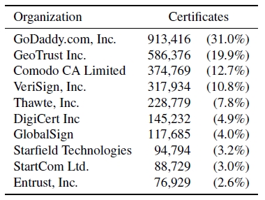

表3：**十大认证中心**——为获取CA生态系统的可见性，我们通过ZMap对HTTPS主机进行了有规律的全面扫描。十个组织掌握了86%的浏览器信任证书。

对CA行为的广泛可见性有助于识别安全问题[10, 18]。我们找到了两个CA证书签发错误的案例。在第一个案例中，我们发现一个CA证书偶然签发给了一名土耳其运输商。这个证书，C=TR, ST=ANKARA, L=ANKARA, O=EGO, OU=EGO BILGI, ISLEM, CN=*.EGO.GOV.TR，之后由谷歌发现了，在谷歌发现它之前，它已经给谷歌的一份通配证书签了名，并且已经被撤回、列入了web浏览器的黑名单之中[20]。

第二个案例中，我们发现了由韩国政府错误签发的CA证书约1300份，这些证书是签发给政府赞助的各类组织的，如学校、图书馆等。然而，这些证书在发布的时候却额外拥有了给其他证书签名的权力，但其祖父CA证书上的长度限制防止了这些组织给新的证书签名。我们没有将这些韩国证书包括进上面所说的总CA证书中，因为他们不能给浏览器信任的有效证书签名。

### 4.2 协议追踪

此前，研究人员已经尝试过了解新协议的采用、地址消耗、常见的配置错误以及活跃扫描的脆弱性的问题[2, 10, 12, 14, 15, 27]。在许多案例中，这些问题的分析都是在IPv4地址空间的随机样本上进行的，因为要操作全面的扫描十分困难[15, 27]。进行了全面扫描的案例往往要耗费很长的一段时间，或者通过云服务供应商大规模并行地执行扫描[10, 14]。ZMap降低了全网扫描的门槛，并允许研究人员以全面和及时的方式进行此类研究，最终实现了相比以往而言更高的解析度测量。

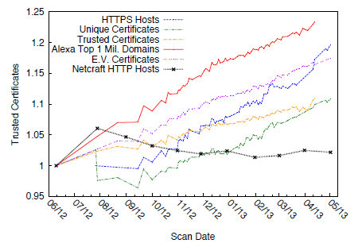

图6：**HTTPS采用情况**——我们通过ZMap收集到的数据显示了一年来HTTPS的部署情况。我们观测到提供HTTPS服务的服务器数量增长了19.6%。

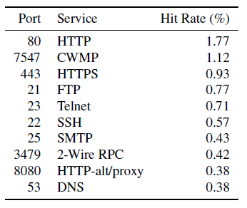

表4：**十大TCP端口**——我们扫描了开放TCP 0-9175端口的215万台主机，并观察每个端口上监听的主机的比例。我们看到与嵌入式设备相关的开放端口数量惊人，例如端口7547 (CWMP)和端口3479(2线RPC)。

为说明协议的应用情况，我们在过去的一年中进行了158次互联网扫描，以追踪HTTPS的采用规模。实验卓有成效，我们发现，在Alexa上排名前一百万的网站中，HTTPS的采用量上升了23%；而在浏览器信任的证书种，HTTPS的采用量上升了10.9%。在这一段时间内，Netcraft网络调研[26]只发现应用HTTP的网站增加了2.2%，而我们观察到应用HTTPS的网站增加了8.5%。图6描绘了协议的增长趋势。

对不同端口的多次ZMap扫描还可以获取多种协议部署的即时可见性。我们扫描了IPv4地址空间内0.05%的样本，对每一样本都扫描其小于9175的TCP端口，以确定开放各个端口的主机的百分比。这个实验需要的包数量与对一个端口进行5次以上的互联网扫描相同，但是我们使用ZMap在一天之内就完成了这个实验。表4展示了我们观察到的十大开放端口。

### 4.3 列举脆弱主机

有了在互联网范围内执行快速扫描的能力，就有可能快速列举出存在特定漏洞的主机[2]。尽管对于研究人员而言，这样的能力可以成为强有力的防御工具——例如，估量一个问题的严重性或者追踪一个补丁的应用情况——但它也为攻击者创造了新的可能性：只要控制极少量的机器，就可以在数分钟内扫描并感染出现了新漏洞的所有公共主机。

**UPnP漏洞** 为探索ZMap在漏洞挖掘方面的应用，我们研究了通用UPnP框架中最近披露的几种漏洞。在2013年1月29日，HD Moore公开揭露了通用UPnP库中的多种漏洞[25]。这些漏洞最终遍布在1500名供销商和6900款产品中间，一个UDP包执行任意代码就可以将它们全部挖掘出来。Moore遵循了责任消息披露准则，和厂商们一起为出现漏洞的库发布了补丁，且许多库都在Moore揭露之前打好补丁了。然而尽管有了这些预防措施，我们仍然在2013年的2月发现至少有340万设备受到这一问题的影响。

为测量这一影响，我们创建了一个专门用于执行UPnP握手的ZMap探测模块。只要大约4小时的时间，就可以从零开始开发这个150-SLOC模块，并执行对IPv4地址空间内公共可用UPnP主机的全面扫描，而在2013年2月11日实验当天，我们只用两个小时就完成了整个过程。本次扫描共找到了1570万可达的公用UPnP设备，其中有256万（16.5%）设备仍在运行对UPnP设备而言易受攻击的Inter SDK版本，还有81万7千（5.2%）设备在使用MiniUPnPd的脆弱版本$。^2$

已知这些脆弱设备通过UDP单包就可能受到感染[25]，我们注意到，这340万台设备可能在大致相同的时间内被感染——远远快于网络运营商的合理响应速度，也快于补丁应用于脆弱主机的速度。利用类似ZMap的工具，从披露漏洞到感染每一台公开的脆弱主机只需要几个小时的时间。

**弱公钥** 我们跟踪了2008年揭露的Debian弱密钥漏洞[3]以及Heninger等人于2012年提出的弱共享密钥，作为我们HTTPS生态系统常规扫描的一部分。图7展示了近年来密钥使用的趋势。

在最近一次的扫描中，我们发现共有44600种不同的证书应用了可分解的RSA密钥，这些证书分别运用在51000台主机上，相较2011年减少了20%[14]。这些证书中有4种是浏览器信任的，最新的一份于2018年8月签发。类似地，我们发现2743种不同的证书包含了Debian弱密钥，其中有96种是浏览器信任的，相较2011年减少了34%[14]，最新的一份在2012年1月签发。我们还观察到，包含了用于Citrix远程控制产品的默认公钥[14]的证书中，浏览器信任的证书数量减少了67%。

我们创建了一个自动化的进程，一旦发现新浏览器可信证书包含了可分解的RSA密钥、Debian弱密钥或默认Citrix密钥，这个进程就会提醒我们，这样我们就可以尝试将漏洞通知证书所有者。

2：尽管摩尔报告了更多的UPnP主机[25]，但他承认他的扫描是在5个月的时间内完成的，并没有考虑到由于IP地址的改变应该多次计算主机。

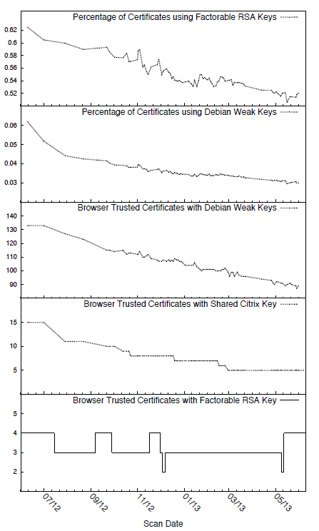

图7：**HTTPS弱密钥使用情况的趋势**——为了探索如何使用ZMap跟踪已知漏洞的缓解状况，从2012年5月到2013年6月，我们监控了弱HTTPS公钥的使用量。

### 4.4 发掘未知服务

进行全网扫描的能力意味着发掘未知服务成为可能，这在以前只能通过已知的主机名或地址实现。例如，洋葱路由器（Tor）网桥就是为防止ISP和政府审查人员阻塞其余洋葱网络的连接而有意不公开的[35]。相反，Tor项目为用户提供的是基于它们源地址的少量网桥IP地址。虽然Tor的开发人员承认互联网扫描在原则上是可以找到这些网桥的，但活跃的网桥却在不断改变，这样当长时间的扫描完成时，获取到的数据就会过时。然而，高速扫描可能用于发动有效的攻击。

为证实这一点，我们在443和9001端口上进行了互联网扫描，这两个端口是Tor网桥和中继器的常用端口，同时还应用了一系列试探性算法辨别可能的Tor结点。对于开放了这两个端口之一的主机，我们会和它进行TCP握手，这里会用到Tor“v1握手”支持的一种特定密码。当Tor中继器接收到这组密码时，它将使用一个双证书链进行响应。这个CA签名证书是由Tor中继器的公钥自签发的，其中主体名形为“CN=www.X.com”，其中X是由随机字母和数字组成的字符串。通过这个模式，实验匹配到了443端口上的67342台主机，以及9001端口上的2952台主机。

我们计算了每台主机的身份指纹，并检查它们的SHA1哈希值是否出现在公共桥接池分配的Tor测量表中。在我们发现的主机当中，443端口有1170个不同的桥接指纹得以匹配，9001端口有1534个，加起来共有1534种不同的指纹（有一些主机的两个端口都匹配到了）。从桥接池的分配数据来看，最近在任意给定时间内都有1767\~1936个不同的指纹分配出去，这说明我们能够在扫描中识别这当中79\~86%的桥接网络。Tor度量列表中不匹配的指纹可能与我们错过的网桥、未接入的网桥或配置为使用9001或443以外端口的网桥相对应。

针对其他用以发现Tor网桥的攻击[38]，Tor项目一直在部署obfsproxy包装器，这种包装器可以将客户网桥连接伪装成为一组随机数据，这样审查人员要发现它们就更困难了。Obfsproxy结点将监听随机的端口，这是针对全面扫描的一种防御措施。

### 4.5 监控服务可用性

主动扫描有助于识别Internet运行中断和服务可用性中断，这种识别无需管理员身份。以前的研究已经表明主动的调查行为有助于追踪Internet运行中断，但它们的调查要么就是根据预想的中断发生地点扫描地址空间内很少的一个子集，要么就是扫描随机的样本[9, 13, 31]。高速扫描使得扫描可以以很高的时间分辨率在样本或是全网内进行。类似地，扫描可以帮助服务供应者识别丢失了对其服务的访问权限的网络和物理区域。

为探索ZMap在追踪服务可用性方面的潜力，我们在飓风桑迪来临期间对IPv4地址空间进行了不间断的扫描，以追踪它对美国东海岸造成的影响。在图8中我们展示了一幅快照，上面是飓风导致的中断地点。

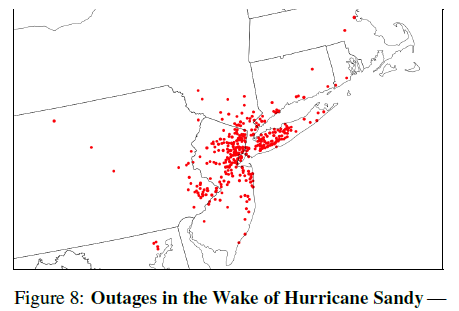

图8：**紧随飓风桑迪而来的运行中断**——2013年10月29~31日间，我们每2小时扫描一次整个IPv4地址空间中的443端口，以追踪飓风桑迪对美国东海岸造成的影响。在图中，我们显示的位置减少了超过30%的监听主机。

### 4.6 隐私与匿名通信

全面高速扫描的出现带来了新的潜在威胁，即隐私威胁，例如在IP地址之间跟踪用户设备的可能性。例如，一家公司可以根据许多家庭路由器和电缆调制解调器提供的HTTPS证书或SSH主机密钥，在动态分配的IP地址之间跟踪家庭Internet用户。这使得追踪公司能将现有的基于IP的追踪扩展到DHCP租赁之外。

在另一种情况下，它也可能用于追踪旅客。2006年，Scholz等人提出了SIP设备的指纹识别方法[30]，而一些其他协议无意间暴露了如加密密钥这样的唯一标识符。这些特性可以用于跟踪特定移动主机的网络位置。如果将这些独特的指纹与公开可用的网络数据和商业地理定位数据库相结合，攻击者就可以推断某                                                                                                                                                                                                              个人的关系和旅行模式了。

快速向所有IPv4地址发送单个包的能力还可以为匿名通信系统提供基础。它可以用来向每个公共IP地址广播加密的短消息，而不是使用扫描器发送探测。在这种情况下，它无法确定所需的目标主机。如果发送方在一个不使用入口过滤的网络上，它还可以进行源地址欺骗以模糊发送方的身份。这种通信方式可能让僵尸网络运营商特别感兴趣，因为它将允许受感染的主机在等待指令时无限期地保持休眠状态，而不是定期检查命令和控制基础设施，这可能暴露它们的存在。

## 5 扫描和良好网络公民身份

我们和资深的同时以及我们本地的网络管理员一起考虑了高速互联网扫描的伦理意蕴，并设计出了一套能够识别和减少风险的指南。这种扫描涉及到与全球大量主机和网络的交互。要从这些网络系统中提前获取所有者的许可是不可能的，且目前并没有与IP级网络等价的HTTP自动排除标准去允许这些系统发出它们不愿意接受扫描的信号。如果我们要执行这样的扫描，我们最多能做的就是尽量减少任何潜在的危害，并让流量接收者能够选择退出进一步的探测。高速扫描要占用大量的带宽，因此我们需要确保我们的活动不会对源网络或是目标网络的服务造成负面影响。我们与本地网络管理员确认，我们的校园网和上游供应商有足够的能力以千兆的速度进行扫描。为避免目标网络过多的情况，我们设计让ZMap能够根据随机排列来扫描地址。这就将流量分散到扫描长度上的任何给定目标网络了。在TCP单帧扫描中，单个目标地址将接收一个40字节的SYN包。如果我们以千兆的最大速度进行扫描，则在44分钟的扫描周期内，每个/24网段都会在每10.6秒内接收到一个数据包（3.8bytes/s），对于/16网段而言是40ms（1000bytes/s），对/8网段而言则是每161μs（250,000bytes/s）。对于这种规模的网络，这些流量应该都可以忽略不计。

尽管有这些预防措施，但与远程系统的任何交互都有可能导致操作问题，这种可能性很小，但也不是零。此外，观察我们的扫描流量的用户或网络管理员可能会感到恐慌，因为他们可能会错误地认为自己受到了攻击。许多人可能无法得知他们的系统不是唯一的目标，而且这些扫描本质上不是恶意的，这可能导致浪费响应资源。还有一些目标系统的所有者可能只是感到恼火，希望我们停止扫描。为了尽量减少这些情况带来的风险，我们采取了一些步骤，以便流量接收方更容易地了解他们为什么会接收到探测帧，并在需要时将他们的地址排除在扫描范围之外。

首先，我们将源地址配置为在端口80上显示的一个简单的网站，描述扫描的性质和目的。该网站将解释说我们并不以个人网站为目标或是进入获取私人系统，同时将提供一个用于联络的邮箱地址，通过这个邮箱地址可以要求将自己的地址从未来的扫描范围内排除。第二，我们将源地址的反向DNS记录设置为“researchscanx.eecs.umich.edu”，以表明这些网络流量只是一项学术研究的一部分。第三，我们与学院的IT团队进行了协作，因为他们可能会收到有关我们扫描流量的询问。

针对正在进行的互联网HTTPS调查（这要用到最大的扫描流量），我们采取了一些额外的步骤进一步减少由入侵检测系统引起的误报率。这个实验中，我们让一次扫描在12小时内完成，没有以最大速度进行。我们还将ZMap配置为使用64个源地址，并在它们之间分散探测流量。然而我们认识到这样很难维持平衡：我们不想向系统管理员隐瞒我们的活动，而系统管理员希望了解这些活动，但是我们也不想转移IT支持资源，否则这些资源将用于处理真正的攻击。表5总结了我们采取的预防措施，未来的研究人员可以将其作为互联网扫描的起点。不用说，扫描从业人员应该避免利用漏洞或访问受保护的资源，并且应该遵守其管辖范围内的任何相关法律要求。

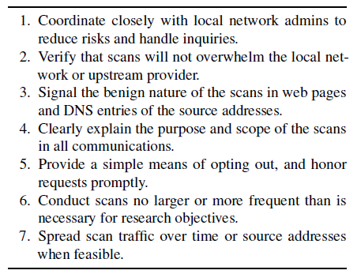

表5：**建议措施**——我们将这些建议提供给要进行快速互联网扫描的其他研究人员，他们可以将这视作保持良好互联网公民身份的指南。

### 5.1 用户响应

在过去的一年里，我们除上述的实践以外还大约进行了200次互联网扫描。我们从145次扫描中的流量接收方处收到了电子邮件，在表6中展示了它们的分类。在大多数情况下，这些响应信息本质上包含了许多信息，提醒我们可能已经有机器受到感染，或是一些要求把自己排除在未来的扫描范围之外的礼貌请求。请求中的绝大部分是由我们学院WHOIS的滥用地址和我们发布在扫描源地址端口上的邮箱接收的，但我们仍收到了一些直接寄到学院求助台上的响应，一些直接寄给我们的首席安全执行官的响应，以及一些寄给我们部门主管的响应。

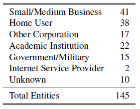

表6：**按实体类型划分的响应**——我们按发出响应的实体类型对扫描过程中收到的响应和抱怨进行了分类。

我们给每个请求都回复了扫描的目的，并立即按要求将发送方的网络从未来的扫描范围中移除。最后，我们总共排除了分属于91个组织和个人的网络，包含3,753,899个地址（占IPv4地址空间的0.11%）。黑名单上约有49%的地址是由两个Internet供应商产生的。我们收到了15个活跃的敌对响应，它们威胁说要通过法律报复我们的学院或是要对我们的网络实施DOS攻击。在这两种情况下，我们确实收到了报复性的DOS流量，但我们的上游供应商直接将其列入了黑名单。

## 6 相关工作

到目前为止已经出现了许多网络扫描工具，它们中的绝大部分已经优化成为了小型网段的扫描器。其中最流行、名气最响亮的就是Nmap（“Network Mapper”）。Nmap是一种通用的、多功能的扫描工具，它能够支持各种各样的扫描技术。而与Nmap不同，ZMap是专门设计于互联网扫描的，在这项应用方面，ZMap的性能要远远超过Nmap。

Leonard和Loguinov介绍了IRLscanner，它也是一种互联网规模的扫描工具，拥有在大约24小时之内展示已知IPv4地址空间探测情况的能力，扫描速率最大时能达到每秒发送24,421个数据包[22]。IRLscanner在使用特定的Windows网络驱动器，IRLstack时，就可以达到这样的扫描速率[33]。然而，IRLscanner并不能处理响应，每次扫描都需要特定的网络驱动器和完整的路由表，并且从不发布社区研究的版本。相比之下，ZMap作为一款独立且内部完善的网络扫描器，并不需要任何特定的驱动器，且我们能够通过开源证书将其发布到社区中。我们发现，实际运行时ZMap能在一秒内发送137万数据包，比IRLScanner快了56倍。

以往的工作一直在开发高网速下收发数据包的方法，这些方法包括PF_RING[8]、PacketShader[11]和netmap[28]，它们全都替换了Linux内核中网络栈的一部分。然而，正如第3.1节所说，我们发现Linux内核不需要任何修改就完全有能力在千兆以太网上发送探测数据包。此外，libpcap完全可以处理所有的响应，不会发生任何丢包的情况，这是因为只有很小一部分的主机会响应探测帧。可以说，当前扫描工具面临的瓶颈并不是网络栈的问题，而是扫描方法体系的问题。

许多项目都已经进行过互联网范围的扫描（如[10, 12, 14, 15, 25, 27]），但这对于部分研究人员而言，是要付出莫大勇气的。在2008年，Heidemann等人提出了一次互联网人口普查，在这次实验中，他们发送ICMP数据包以定位IP地址，尝试确定IPv4地址的使用情况；他们对IPv4地址空间的扫描大约持续了3个月，并宣称这是自1982年以来首次进行的互联网范围调研[12]。最近还有两个项目想要研究HTTPS的安全性，他们的情况和Heidemenn差不多。2010年，电子前线基金会（EFF）使用Nmap实施了一次对IPv4地址空间的扫描，他们想要找到开放了443端口（HTTPS）的主机，并将这一实验作为他们SSL观测项目的一部分[10]；这次扫描动用了三台Linux服务器，大约花了三个月才得以完成。Heninger等人的IPv4地址空间扫描进行了两次，2011年是扫描443端口（HTTPS），2012年则是扫描22端口（SSH），后者是一项弱密钥研究的一部分[14]。现在，只要花300美元，一台25 Amazon EC2，就可以让研究人员在25小时内完成扫描。但我们的研究表示，ZMap可以以更快的速度收集到同样的数据，开销还要低不少。

2012年，距离现在最近的一个项目中，一个匿名组织进行了一次非法的“互联网人口普查”，他们自称为Carna Botnet。这个僵尸网络使用默认密码登录了成千上万的网络通讯设备。登录之后，它将扫描其他脆弱的网络通讯设备并在IPv4地址空间内开始多次扫描，在3个月的时间内，这次扫描涵盖了600个TCP端口和100个UDP端口[1]。有了这样的分布式架构，这次扫描的发出者宣称它们已经可以在一小时内扫描整个IPv4空间的某一端口了。ZMap也可以拥有类似的性能，但它不需要利用任何窃取来的资源。

## 7 未来展望

现在我们已经介绍了在千兆网上高效扫描IPv4地址空间的可能性，但在高速扫描某些协议的情况下，可能还是会出现问题。

**扫描IPv6** 尽管ZMap能够快速扫描IPv4地址空间，但对于IPv6地址空间而言，ZMap的暴力扫描算法就不能满足实际应用了，因为IPv6的地址空间范围实在太大，无法进行枚举[7]。这就给了如今的研究人员一个提醒：要在仅支持IPv6的设备大范围投入应用之前利用高速扫描的方法论。要在现在的高速扫描之上发展新的方法论，就需要针对IPv6地址进行了。

**万兆以太网调研** 目前广泛使用的千兆网限制了ZMap的速度，我们还没有测试万兆以太网和更快的网络可用出现时它的体系结构将扩展到什么程度。我们有动力利用更快的网络将扫描的速度发挥到极限，因为我们相信这些网络能够给予我们最真实的即时网络快照。然而，这些更快的速率也带来了目标网络和主机过载的问题。我们还没有探索万兆以太网高速扫描的机制。

**服务器名称指示** 服务器名称指示（SNI）是一种TLS扩展协议，它允许服务器在同一个IP地址上显示多个证书[6]。目前SNI还没有大范围部署，这很可能是因为Windows XP机器上的IE浏览器并不支持这一协议[21]。然而，该协议应用范围不可避免的扩展将使扫描HTTPS站点变得更加复杂，因为简单地枚举地址空间将丢失仅具有正确SNI主机名的证书。

**扫描排除标准** 如果互联网扫描应用得更加广泛，对于不想接收此类探测流量的系统运营商来说，手工选择不接收所有良性来源将变得越来越麻烦。因此，标准化信号排除机制还需要进一步的工作，工作的方向类似于HTTP的robots.txt[19]。例如，主机可以使用协议标志的组合来发送“请勿扫描”信号，可能通过使用SYN和RST标志响应不需要的SYN，或者设置特定的TCP选项。

## 8 总结

我们生活在互联网历史上一个独特的时期：典型的办公网络已经快到有能力彻底地扫描IPv4地址空间，然而IPv6（拥有更广的地址空间）还没有大范围部署。为了帮助研究人员充分利用这一机会，我们开发了ZMap，这是一种专门为执行快速、全面的internet范围调查而设计的网络扫描程序。

我们的实验表明，ZMap能够在45分钟内扫描公共IPv4地址空间的某个端口，理论上的扫描速度能够达到千兆以太网的97%，估计覆盖范围大约是公共主机数的98%。我们探究了高速扫描在安全方面的应用，包括在Internet范围内跟踪协议采用的能力，以及及时了解不透明的分布式系统（如CA生态系统）的能力。接着我们进一步表明，高速扫描同时也提供了新的攻击方式，我们必须在设计防御系统时考虑到这一点，这些攻击方式包括发掘未知服务的能力、在IP地址之间追踪用户的可能性，以及在漏洞发布的数分钟之内大面积感染脆弱主机的风险。我们希望ZMap能将互联网范围内的扫描从昂贵而耗时的工作提升为未来安全研究的常规方法。在互联网扫描常规化的同时，实践者应当保证自己良好互联网公民的身份，将网络和主机受到的风险最小化，并对流量接收方的请求作出响应。我们提供了执行自己的扫描时设计的建议，未来的研究人员可以将其作为进一步讨论良好扫描实践的起点。

## 鸣谢

笔者感谢密歇根大学杰出的系统管理员在整个项目中提供的帮助和支持。如果没有Kevin Cheek、Laura Fink、Paul Howell、Don Winsor和其他来自ITS、CAEN、DCO的朋友们的帮助，这项研究不可能完成。我们感谢Michael Bailey在研究的多个方面提出的建议，感谢Oguz Durumeric与我们讨论如何在IPv4地址空间内生成地址序列。同时，我们还感谢Brad Campbell、Peter Eckersley、James Kasten、Pat Pannuto、Amir Rahmati、Michael Rushanan和Seth Schoen。这项工作得到了美国国家科学基金会NSF的CNS-1255153和NFS研究奖学金的部分支持。

## 参考资料

[1] Anonymous. Internet census 2012. http://census2012.sourceforge.net/paper.html, March 2013.

[2] G. Bartlett, J. Heidemann, and C. Papadopoulos. Understanding passive and active service discovery. In *7th ACM SIGCOMM conference on Internet measurement (IMC)*, pages 57–70, 2007.

[3] L. Bello. DSA-1571-1 OpenSSL—Predictable random number generator, 2008. Debian Security Advisory. http://www.debian.org/security/2008/dsa-1571.

[4] D. J. Bernstein. SYN cookies. http://cr.yp.to/syncookies.html, 1996.

[5] J. Black, S. Halevi, H. Krawczyk, T. Krovetz, and P. Rogaway. UMAC: Fast and secure message authentication. In *Advances in Cryptology*—CRYPTO ’99, 1999.

[6] S. Blake-Wilson, M. Nystrom, D. Hopwood, J. Mikkelsen, and T. Wright. Transport Layer Security (TLS) Extensions. RFC 3546 (Proposed Standard), June 2003. 

[7] T. Chown. IPv6 Implications for Network Scanning. RFC 5157 (Informational), March 2008. 

[8] L. Deri. Improving passive packet capture: Beyond device polling. In *4th International System Administration and Network Engineering Conference (SANE)*, 2004.

[9] R. Dingledine. Research problems: Ten ways to discover Tor bridges. http://blog.torproject.org/blog/researchproblems-ten-ways-discover-tor-bridges, October 2011.

[10] P. Eckersley and J. Burns. An observatory for the SSLiverse. Talk at Defcon 18 (2010). https://www.eff.org/files/DefconSSLiverse.pdf. 

[11] S. Han, K. Jang, K. Park, and S. Moon. PacketShader: A GPU-accelerated software router. In *ACM SIGCOMM*, September 2010. 

[12] J. Heidemann, Y. Pradkin, R. Govindan, C. Papadopoulos, G. Bartlett, and J. Bannister. Census and survey of the visible Internet. In *8th ACM SIGCOMM conference on Internet measurement (IMC)*, 2008.

[13] J. Heidemann, L. Quan, and Y. Pradkin. A preliminary analysis of network outages during hurricane sandy. Technical Report ISI-TR-2008-685b, USC/Information Sciences Institute, November 2012.

[14] N. Heninger, Z. Durumeric, E. Wustrow, and J. A. Halderman. Mining your Ps and Qs: Detection of widespread weak keys in network devices. In *21st USENIX Security Symposium*, August 2012.

[15] R. Holz, L. Braun, N. Kammenhuber, and G. Carle. The SSL landscape: A thorough analysis of the X.509 PKI using active and passive measurements. In *11th ACM SIGCOMM conference on Internet measurement (IMC)*, pages 427–444, 2011.

[16] IANA. IPv4 address space registry. http://www.iana.org/assignments/ipv4-address-space/ipv4-address-space.xml.

[17] V. Jacobson, C. Leres, and S. McCanne. libpcap. Lawrence Berkeley National Laboratory, Berkeley, CA. Initial release June 1994.

[18] J. Kasten, E.Wustrow, and J. A. Halderman. Cage: Taming certificate authorities by inferring restricted scopes. In *17th International Conference on Financial Cryptography and Data Security (FC)*, 2013.

[19] M Koster. A standard for robot exclusion. http://www.robotstxt.org/orig.html, 1994.

[20] A. Langley. Enhancing digital certificate security. Google Online Security Blog, http://googleonlinesecurity.blogspot.com/2013/01/enhancing-digital-certificate-security.html, January 2013.

[21] E. Law. Understanding certificate name mismatches. http://blogs.msdn.com/b/ieinternals/archive/2009/12/07/certificate-name-mismatch-warnings-and-server-nameindication.aspx, December 2009. 

[22] D. Leonard and D. Loguinov. Demystifying service discovery: Implementing an Internet-wide scanner. In *10th ACM SIGCOMM conference on Internet measurement (IMC)*, pages 109–122, 2010.

[23] Gordon Fyodor Lyon. *Nmap Network Scanning: The Official Nmap Project Guide to Network Discovery and Security Scanning.* Insecure, USA, 2009.

[24] N. Mathewson and N. Provos. libevent—An event notification library. http://libevent.org.

[25] HD Moore. Security flaws in universal plug and play. Unplug. Don’t Play, January 2013. http://community.rapid7.com/servlet/JiveServlet/download/2150-1-16596/SecurityFlawsUPnP.pdf.

[26] Netcraft, Ltd. Web server survey. http://news.netcraft.com/archives/2013/05/03/may-2013-web-server-survey.html, May 2013.

[27] N. Provos and P. Honeyman. ScanSSH: Scanning the Internet for SSH servers. In *16th USENIX Systems Administration Conference (LISA)*, 2001.

[28] Luigi Rizzo. netmap: A novel framework for fast packet I/O. In *2012 USENIX Annual Technical Conference*, 2012.

[29] S. Sanfilippo and P. Noordhuis. Redis. http://redis.io.

[30] H. Scholz. SIP stack fingerprinting and stack difference attacks. Talk at Blackhat 2006. http://www.blackhat.com/presentations/bh-usa-06/BH-US-06-Scholz.pdf.

[31] A. Schulman and N. Spring. Pingin’ in the rain. In *11th ACM SIGCOMM conference on Internet measurement (IMC)*, pages 19–28, 2011.

[32] K. Sklower. A tree-based packet routing table for Berkeley Unix. In *Winter USENIX Conference*, 1991.

[33] M. Smith and D. Loguinov. Enabling high-performance Internet-wide measurements on Windows. In *11th International Conference on Passive and Active Measurement (PAM)*, pages 121–130. Springer, 2010.

[34] W. R. Stevens and G. R. Wright. *TCP/IP Illustrated: The Implementation*, volume 2. Addison-Wesley, 1995.

[35] Tor Project. Tor Bridges. https://www.torproject.org/docs/bridges, 2008.

[36] Tor Project. obfsproxy. https://www.torproject.org/projects/obfsproxy.html.en, 2012.

[37] J. Viega, M. Messier, and P. Chandra. Network Security with *OpenSSL: Cryptography for Secure Communications.* O’Reilly, 2002.

[38] T. Wilde. Great Firewall Tor probing. https://gist.github.com/twilde/da3c7a9af01d74cd7de7, 2012.